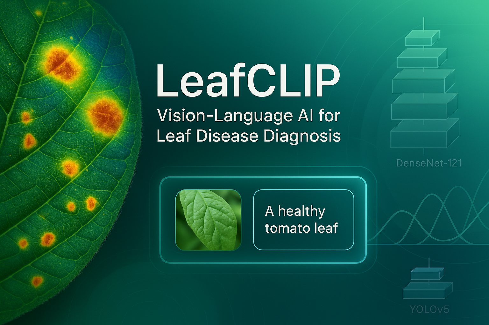

🌿 LeafCLIP: Vision-Language Model for Leaf Disease Diagnosis

**LeafCLIP** is a powerful vision-language model built on top of **Swin-B** (as the vision encoder) and **SigLIP2** (as the text encoder), fine-tuned on **LeafNetV2**, a comprehensive dataset of over **255,000 image-text pairs** spanning **197 classes** of crop leaf diseases. The model is designed to bring interpretability and efficiency to smart agriculture by enabling multi-modal learning from both images and their natural language descriptions.

---

## 🧠 Model Architecture

LeafCLIP adopts a CLIP-style dual-encoder framework:

- 🔍 **Vision Encoder**: [Swin Transformer - Base (Swin-B)](https://arxiv.org/abs/2103.14030)  
- 📝 **Text Encoder**: [SigLIP2](https://arxiv.org/abs/2310.11575), a state-of-the-art language model optimized for image-text alignment  
- 🔗 **Training Objective**: Contrastive learning using InfoNCE loss on aligned image-text pairs

---

## 🌱 Dataset: LeafNetV2

LeafNetV2 is a large-scale, curated dataset for multi-class leaf disease classification.  

- 📦 **Total Samples**: 255,000+ image-text pairs  
- 🌾 **Classes**: 197 leaf disease types across 40+ crops  
- 🖼️ **Image Size**: Variable, resized to 224x224 for training  
- 🗣️ **Captions**: Descriptive phrases following the format:  
), a state-of-the-art language model optimized for image-text alignment  
- 🔗 **Training Objective**: Contrastive learning using InfoNCE loss on aligned image-text pairs

---
## Demo in [here](https://leafclip.streamlit.app/)
